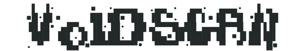

<div id="top"></div>

<!-- PROJECT SHIELDS -->
<!--
*** I'm using markdown "reference style" links for readability.
*** Reference links are enclosed in brackets [ ] instead of parentheses ( ).
*** See the bottom of this document for the declaration of the reference variables
*** for contributors-url, forks-url, etc. This is an optional, concise syntax you may use.
*** https://www.markdownguide.org/basic-syntax/#reference-style-links
-->

<!-- PROJECT LOGO -->
<br />
<p align="center">
  
</p>

<h1 align="center">A Blackbox Reconnaissance Tool</h1>

<p align="center">
  <a href="https://python.org/">
    
  </a>
    <a href="https://github.com/michkz/voidscan/releases">
    
  </a>
  <a href="https://github.com/michkz/voidscan/blob/master/LICENSE">
    
  </a>
    <a href="https://opensource.org">
    
  </a>
</p>

<p align="center">
  Voidscan is a free and open-source Blackbox Reconnaissance Tool that gathers information about a given scope.
</p>

<br />


## Disclaimer

THIS SOFTWARE IS PROVIDED "AS IS" WITHOUT WARRANTY OF ANY KIND. YOU MAY USE THIS SOFTWARE AT YOUR OWN RISK. THE USE IS COMPLETE RESPONSIBILITY OF THE END-USER. THE DEVELOPERS ASSUME NO LIABILITY AND ARE NOT RESPONSIBLE FOR ANY MISUSE OR DAMAGE CAUSED BY THIS PROGRAM.


<!-- TABLE OF CONTENTS -->
### Table of contents

 - [About the Project] (#about)
 - [Getting Started] (#gettingstarted)
 - [Usage] (#usage)
 - [Features] (#features)
 - [Roadmap] (#roadmap)
 - [License] (#license)
 


<!-- ABOUT THE PROJECT -->

## About The Project

The goal of this project is to fully automate the reconnaissance phase when conducting a penetration test. It uses a textfile which contains an asset per line to scan through a number of tools. Once the program is done scanning, the gathered results will be presented in the form of a markdown report.

This started as an internship assignment, but will be updated regulary with new tools and code improvements.


<p align="right">(<a href="#top">back to top</a>)</p>

<!-- GETTING STARTED -->

## Getting Started

To get a local copy up and running follow these simple example steps.

### Prerequisites

Before you can use this program, make sure you have Python 3.8 or higher installed.

##### MacOS
```bash
$ brew install python@3.8
```
##### Windows
Download the right Python version from the [Official Website](https://www.python.org/downloads/windows/)
##### Unix/Linux  
```bash
$ sudo apt-get install python3.8
```

### Installation

####1. Get the repository

```bash
$ git clone https://github.com/michkz/voidscan
```

####2. Go into the repository

```bash
$ cd voidscan/
```

####3. Install the requirements
```bash
$ pip install -r requirements.txt
```

####4. Run the program

```bash
$ python3.8 main.py -f [file.txt]
```

<p align="right">(<a href="#top">back to top</a>)</p>

<!-- USAGE EXAMPLES -->

## Usage

To use the program, simply go into the project's folder and use the following command

```bash
$ python3.8 main.py -f [file.txt]
```
Where ``` [file.txt]``` has an asset per line, like in the example below

```bash
# Example of the file.txt contents
127.0.0.1
http://zonetransfer.me/
```


<p align="right">(<a href="#top">back to top</a>)</p>

## Features

At the moment the current version consists of the following tools that have a checkmark in the table below. The planned tools are marked with a date or are still TBD 


| Tool            |  Status |
|:----------------|:-------:|
| `Host` 			 |    ✔    |
| `Curl` 			 |    ✔    |
| `Nmap`   		 |    ✔    |
| `Dirbuster`   	 |   TBD   |

#### Host
The host tool allows to collect IPv4, IPv6 and mail server addresses, as well as DNS zonetransfer information if possible. It will use the following commands within this program

```
# Where asset will be retrieved from the scope.
host [asset]
```
```
# Where asset will be retrieved from the scope.
host -t ns [asset]
```
```
# Where asset will be retrieved from the scope and the nameserver from the previous command.
host -t axfr [asset] [nameserver]
```

#### Curl
The curl tool allows to collect useful header information and will use the following commands within this program

```
# Where asset will be retrieved from the scope.
curl -I [asset]
```

#### Nmap
The nmap tool will collect the open ports and services. It will use the following commands within this program

```
# Where asset will be retrieved from the scope.
nmap [asset]
```

<p align="right">(<a href="#top">back to top</a>)</p>

<!-- LICENSE -->

## License

Distributed under the MIT License. See `LICENSE.txt` for more information.

<p align="right">(<a href="#top">back to top</a>)</p>

<!-- CONTACT -->

## Contact

Michkz - michkz@protonmail.com

Project Link: [https://github.com/michkz/voidscan](https://github.com/michkz/voidscan)

<p align="right">(<a href="#top">back to top</a>)</p>


<!-- MARKDOWN LINKS & IMAGES -->
<!-- https://www.markdownguide.org/basic-syntax/#reference-style-links -->

[contributors-shield]: https://img.shields.io/github/contributors/github_username/repo_name.svg?style=for-the-badge
[contributors-url]: https://github.com/github_username/repo_name/graphs/contributors
[forks-shield]: https://img.shields.io/github/forks/github_username/repo_name.svg?style=for-the-badge
[forks-url]: https://github.com/github_username/repo_name/network/members
[stars-shield]: https://img.shields.io/github/stars/github_username/repo_name.svg?style=for-the-badge
[stars-url]: https://github.com/github_username/repo_name/stargazers
[issues-shield]: https://img.shields.io/github/issues/github_username/repo_name.svg?style=for-the-badge
[issues-url]: https://github.com/github_username/repo_name/issues
[license-shield]: https://img.shields.io/github/license/github_username/repo_name.svg?style=for-the-badge
[license-url]: https://github.com/github_username/repo_name/blob/master/LICENSE.txt
[linkedin-shield]: https://img.shields.io/badge/-LinkedIn-black.svg?style=for-the-badge&logo=linkedin&colorB=555
[linkedin-url]: https://linkedin.com/in/linkedin_username
[product-screenshot]: images/screenshot.png
